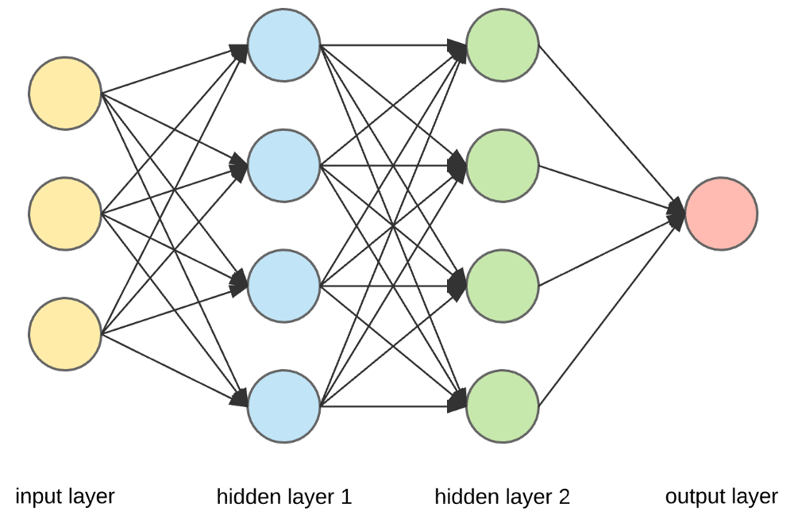
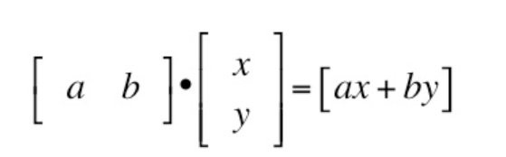
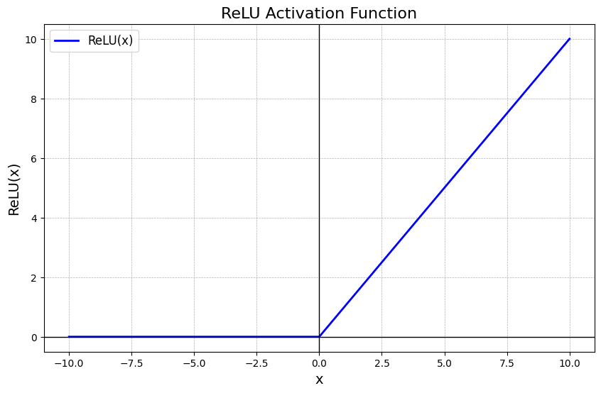
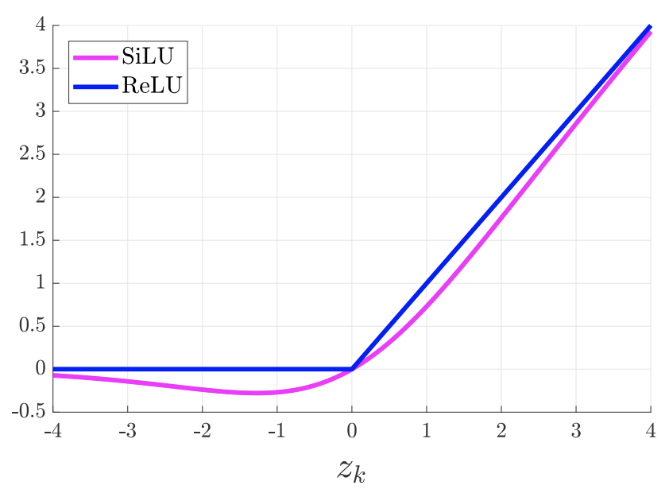
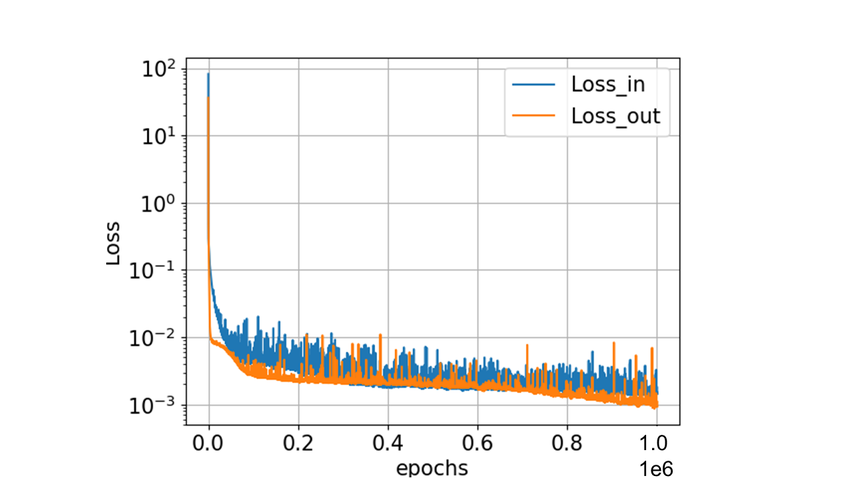
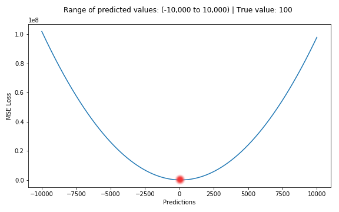
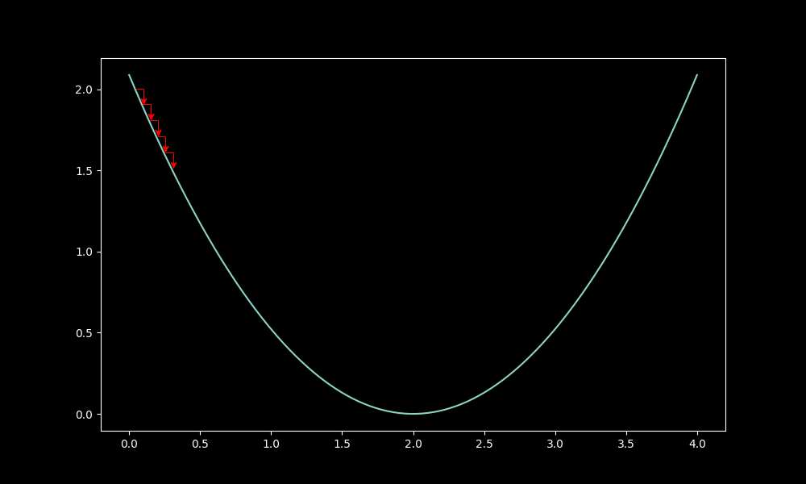
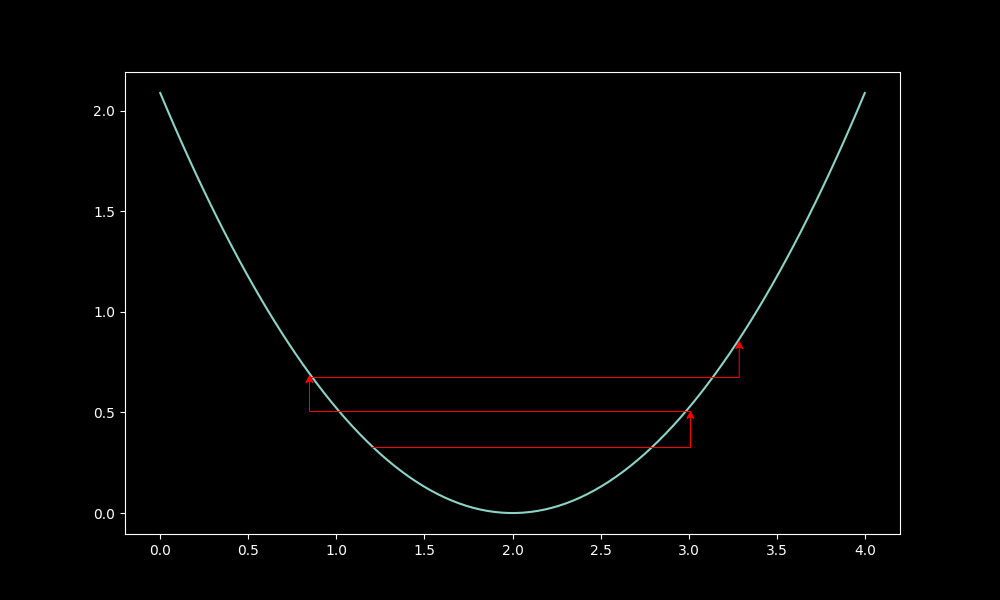

# Making your first Neural Network

This is a simplified intro, enough to get you to understand optimization and how the learning process is affected, for a deeper explanation, look into [Neural Networks from Scratch in Python](https://nnfs.io/)



This is the simplest form of Neural Network. 

Input → Processing → Output

You might notice that this is really similar to a mathematical function X → Y with a formula in the middle. 

A Neural Network splits this into three sections:

- **input layer**: where you feed in numbers (your data).  
- **hidden layers**: where the math happens (processing).  
- **output layer**: where you get predictions/answers.

## step 1: input layer

let's say you want to predict whether a student passes or fails based on how many hours they studied and how much they slept.

example input:  
- hours studied = `5`  
- hours slept = `7`

we put that into a list:

```python
inputs = [5, 7]
```

## step 2: weights and bias

a neural network wont just take the input directly, it uses weights and biases to adjust them. Weights are a way to scale the number, a way to see how "important" each input is, and a bias is a single number that is used to shift the inputs

Here we just use random starting values:

```python
weights = [0.1, 0.2]
bias = 0.5
```

## step 3: the dot product

we need to get the dot product of the inputs and the weights, shifted by the bias. You've probably seen a 2x2 dot product in linear algebra or basic calc



In practice, it looks like this:

```python
output = (inputs[0] * weights[0]) + (inputs[1] * weights[1]) + bias
print(output)
```

## step 4: the activation function

if we stop here, the network is just doing linear math. to make it handle complex patterns, we apply a non-linear function called an activation function.

There are many non-linear activation functions, but the one we are using here is ReLU, which looks like this:

ReLU(x) = max(0, x)



In my personal experience the SiLU function works best, often a 5-10% performance jump on relu, it looks like this:



we can add the relu function to our code like this:

```python
def relu(x):
    return max(0, x)

activated_output = relu(output)
print(activated_output)
```

## step 5: the output layer

since we have a pass/fail situation, we have two outputs, represented by 0 and 1, to force our outputs in the 0 to 1 range, we can use a sigmoid function, which looks like this:


we can use it in our code through the math library:

```python
import math

def sigmoid(x):
    return 1 / (1 + math.exp(-x))

final_output = sigmoid(output)
print(final_output)
```

`final_output` will be between 0 and 1, like a probability (ex. 0.8 → 80% chance of passing)

putting it all together for now with a couple variable name changes to represent the diagram, gives us the structure of the neural network

```python
import math

# inputs
inputs = [5, 7]

# weights and bias (randomly chosen for now)
weights = [0.1, 0.2]
bias = 0.5

# step 1: linear combination
output = (inputs[0] * weights[0]) + (inputs[1] * weights[1]) + bias

# step 2: activation
def relu(x):
    return max(0, x)

hidden = relu(output)

# step 3: output activation (sigmoid)
def sigmoid(x):
    return 1 / (1 + math.exp(-x))

final_output = sigmoid(hidden)
print("prediction:", final_output)
```

## step 6: actually training the neural net

rn the weights/bias are random, so predictions are useless. training = adjusting them until outputs match the right answers.

process:

give the network data (inputs), compare output with the correct answer (error), adjust weights/bias a little to reduce error, repeat this thousands of times.

this is called gradient descent + backpropagation.

we wont be diving into the calculus here, as its a more advanced topic, but you can find a detailed breakdown [here](https://www.youtube.com/watch?v=VMj-3S1tku0)

The loss plot usually looks like this as the NN tries to reach a loss of zero:



how does the NN know how to move in the right direction to reduce loss?

when the NN makes a prediction, theres a certain amount of error between it and the true known answer, we get the mean squared error using code like this:

`MSE = (truth-pred)**2`

This forms a chart that looks like this:



the closer you are to the true answer, the lower on the graph you'll be.

this learning process moves the neural networks weights in a direction, positive/negative, and that amount is scaled by the `learning_rate` or `lr`, which is a number, usually between `1e-3` and `1e-5`, that makes sure we dont update to much too fast

When you move too slow, you'll end up taking too long, wasting expensive GPU time when working with larger models:



On the other hand, move too fast, and you worsen the model:



## wrapping up

we are using pytorch, a standard NN library, for the final code, simply because the backpropagation involved in training is complicated and time consuming, and torch will handle that for us here

the final code looks like this:

```python
import torch
import torch.nn as nn

# dataset (hours studied, hours slept) → pass/fail
X = torch.tensor([[5.0, 7.0], [1.0, 2.0], [10.0, 6.0]])
y = torch.tensor([[1.0], [0.0], [1.0]])

# model
model = nn.Sequential(
    nn.Linear(2, 1),   # 2 inputs → 1 output
    nn.Sigmoid()       # squash into 0–1
)

# loss + optimizer
loss_fn = nn.MSELoss()
optimizer = torch.optim.SGD(model.parameters(), lr=0.1) # higher here because we are a simple, tiny neural network 

# training loop
for epoch in range(100):
    y_pred = model(X)
    loss = loss_fn(y_pred, y)
    optimizer.zero_grad()
    loss.backward()
    optimizer.step()

print("prediction for [5,7]:", model(torch.tensor([5.0,7.0])))
```


